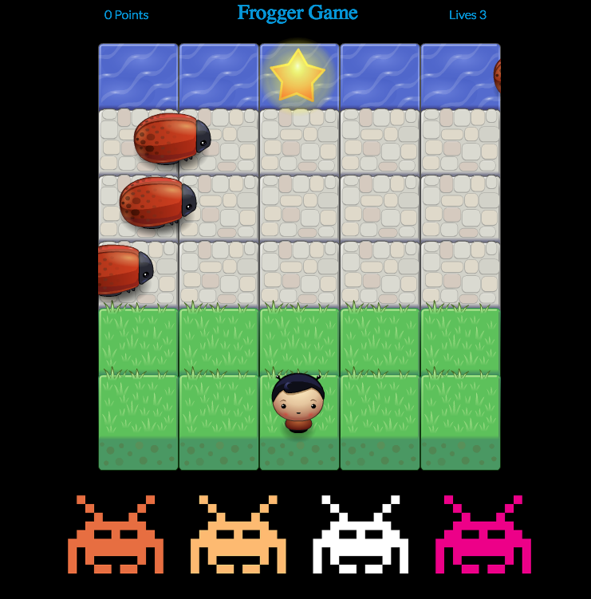
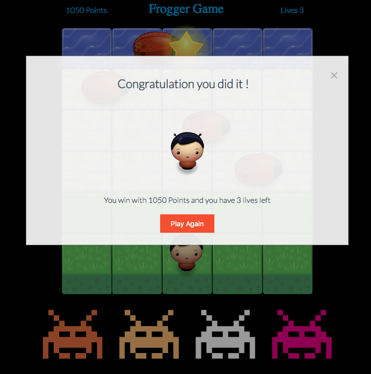
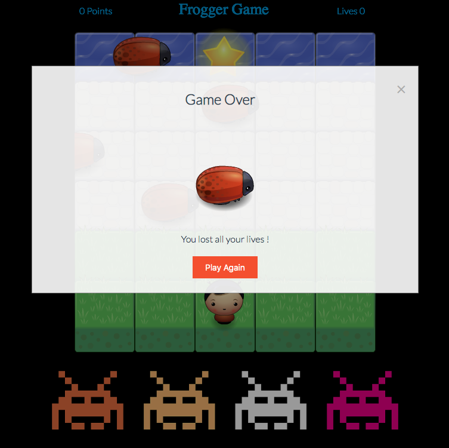

# Arcade Game Project

The classic arcade game or Frogger game is an Udacity project. Using  `Object-Oriented JavaScript`  and `Object constructor`enable an interactive experience while having fun.

## Table of Contents

* [How to Run the Application](#How-to-Run-the-Application)
* [How to Play](#How-to-Play)
* [Tools & Techniques](#Tools-and-Techniques)
* [Assets](#Assets)
* [Credits](#credits)

## How to Run the Application

1. You can download or clone this repository.

2. Find the `index.html` file, and open the file in a modern browser.

3. Use the arrow of your keyboard to start the game 

## How to Play

In this game you have a Player and Enemies (bugs). The goal of the player is to reach the water and 1000 points, without colliding into any one of the enemies.

* The player can move left, right, up and down
* The enemies move at varying speeds on the paved block portion of the game board
* Once a the player collides with an enemy, the game is reset and the player moves back to the starting square
* Once the player reaches the water and 1000 points (i.e., the top of the game board), the game is won

1.Starting the game

2.Winning the game

3.Losing the game

## Tools and Techniques

* Object-Oriented JavaScript
* constructor functions to create multiple Enemy instances
* prototypal inheritance
* HTML5 Canvas API
* resource loading via immediately-invoked function expressions (IIFE)

## Assets

This project consists of the following assets:

* **index.html**  - contains the game's html structure.
* **style.css** - contains the game's board styling.
* **app.css** - contains all the board actions & logic.
* **engine.js** - contains the game logic and engine.
* **ressource.js** - contains all the ressources.

## Credits

* For **Collision, condition and consequence** - Source: https://developer.mozilla.org/en-US/docs/Games/Techniques/2D_collision_detection : Udacity mentor Carlos
* For a good understanding of the project : Udacity Student Leader Ryan Waite
* For the bugs random speed -  Source: https://www.w3schools.com/jsref/jsref_random.asp
* For displaying the score - Source: https://developer.mozilla.org/en-US/docs/Games/Tutorials/2D_Breakout_game_pure_JavaScript/Track_the_score_and_win
* For the congratulations Popup - Source : https://www.w3schools.com/howto/howto_css_modals.asp
